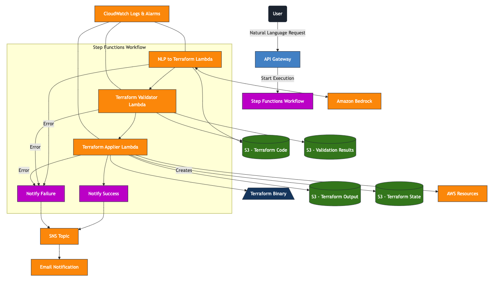
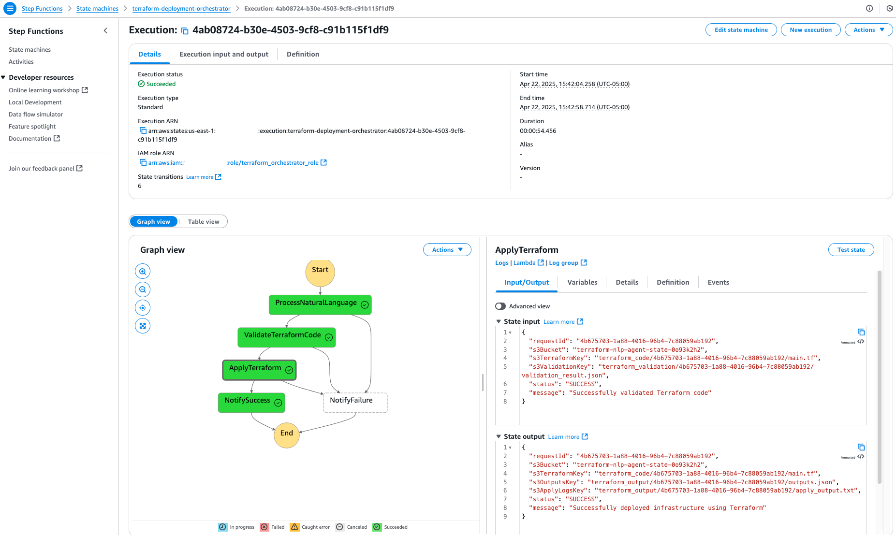

# NLP to Terraform Conversion System

A serverless application that converts natural language infrastructure descriptions into deployable Terraform code using AWS services.

## Overview

The NLP to Terraform Conversion System lets users describe infrastructure requirements in natural language and automatically converts them into Terraform code that is then deployed to AWS. This system leverages AWS Lambda, Step Functions, S3, API Gateway, and Amazon Bedrock to create a fully automated infrastructure-as-code pipeline.

## Architecture

The system consists of the following components:

1. **API Gateway**: Receives natural language infrastructure requests from users
2. **Step Functions**: Orchestrates the workflow between Lambda functions
3. **Lambda Functions**:
   - **NLP to Terraform Converter**: Converts natural language to Terraform code using Bedrock
   - **Terraform Validator**: Validates the generated Terraform code
   - **Terraform Applier**: Executes the Terraform code to deploy the infrastructure
4. **S3 Bucket**: Stores Terraform code, state, plans, and outputs
5. **SNS Topic**: Sends notifications about deployments
6. **CloudWatch**: Provides logging and monitoring for all components



## How It Works

1. The user submits a natural language description of the infrastructure they want to deploy (e.g., "Create an S3 bucket with versioning enabled and a CloudFront distribution in front of it")
2. The API Gateway forwards this request to the Step Functions workflow
3. The Step Functions workflow executes the following steps:
   - Converts the natural language request to Terraform code using Bedrock
   - Validates the generated Terraform code for syntax errors
   - Executes the Terraform code to deploy the actual infrastructure
4. Notifications are sent at the end of the process with the deployment status
5. All artifacts (code, plans, outputs) are stored in S3 for reference



## Implementation Details

### Lambda Function: NLP to Terraform Converter

This Lambda function uses Amazon Bedrock with Claude 3 Sonnet to convert natural language into Terraform code. The function:

1. Receives natural language input
2. Calls Bedrock with a prompt that instructs Claude to act as an AWS architect
3. Extracts the generated Terraform code from the response
4. Stores the code in S3 for the next step

### Lambda Function: Terraform Validator

This Lambda function validates the generated Terraform code for basic syntax errors before attempting to deploy it. The function:

1. Downloads the Terraform code from S3
2. Checks for common syntax errors (unbalanced braces, missing providers, etc.)
3. Reports validation results

### Lambda Function: Terraform Applier

This Lambda function executes the validated Terraform code to deploy the actual infrastructure. The function:

1. Downloads the Terraform code from S3
2. Modifies S3 bucket names to ensure uniqueness
3. Sets up AWS region configurations
4. Creates backend configuration for state management
5. Initializes Terraform
6. Creates and applies a Terraform plan
7. Stores outputs and logs in S3

## Technical Challenges and Solutions

### 1. Lambda Constraints

**Challenges**:
- Lambda has a 15-minute execution timeout
- The /opt directory (where Lambda layers are mounted) is read-only
- Creating CloudFront distributions can exceed 15 minutes

**Solutions**:
- Copy the Terraform binary to the writable /tmp directory
- Set a subprocess timeout just under Lambda's maximum (13 minutes)
- For very long-running operations, consider implementing state machine patterns

### 2. S3 Bucket Naming

**Challenges**:
- S3 bucket names must be globally unique across all AWS accounts
- Generated Terraform code might use common names

**Solutions**:
- Automatically add unique suffixes to bucket names based on the request ID
- Use regex to identify and modify bucket configurations

### 3. AWS Region Configuration

**Challenges**:
- Region inconsistency between Lambda and Terraform
- Duplicate provider configurations

**Solutions**:
- Set the AWS region explicitly in multiple places (environment variables, configuration files)
- Check for existing provider configurations before adding new ones

### 4. Terraform State Management

**Challenges**:
- Managing Terraform state across multiple deployments
- Ensuring idempotent operations

**Solutions**:
- Use S3 backend for state storage
- Create unique state paths based on request IDs

## Deployment and Usage

### Prerequisites

1. AWS account with appropriate permissions
2. Terraform installed locally
3. AWS CLI configured

### Deployment Steps

1. Clone the repository
2. Deploy the infrastructure using Terraform: 
```bash
terraform init
terraform apply
```
3. Note the API Gateway endpoint URL from the outputs

### Usage

1. Send a POST request to the API Gateway endpoint with a JSON body: 
```json
{
  "input": "Create an S3 bucket with versioning enabled and a CloudFront distribution in front of it"
}
```
2. The system will process the request and provide a response with a request ID
3. Check the S3 bucket for deployment results in the `terraform_output/[request-id]/` directory
4. Deployment notifications will be sent to subscribed email addresses

## Error Handling and Monitoring

- All Lambda functions include comprehensive logging
- CloudWatch alarms monitor for errors
- SNS notifications provide real-time alerts on failures
- Failed executions are properly handled in the Step Functions workflow

## Security Considerations

- IAM roles follow the principle of least privilege
- S3 buckets are encrypted
- API Gateway can be configured with AWS_IAM authorization
- Terraform state is stored securely

## Limitations and Future Improvements

### Current Limitations

- 15-minute Lambda timeout limits the complexity of deployable infrastructure
- CloudFront distributions and other long-running resources might time out
- Complex infrastructure might require multiple requests

### Future Improvements

- Implement asynchronous deployment for long-running resources
- Add support for viewing and managing deployed infrastructure
- Enhance natural language understanding with fine-tuned models
- Add support for destroying infrastructure
- Implement approval workflows for sensitive resources

## Conclusion

The NLP to Terraform Conversion System provides a powerful way to deploy AWS infrastructure using natural language, reducing the learning curve for Terraform and making infrastructure deployment more accessible. By leveraging AWS serverless services and AI capabilities, it streamlines the infrastructure-as-code process while maintaining the necessary controls and validations.
